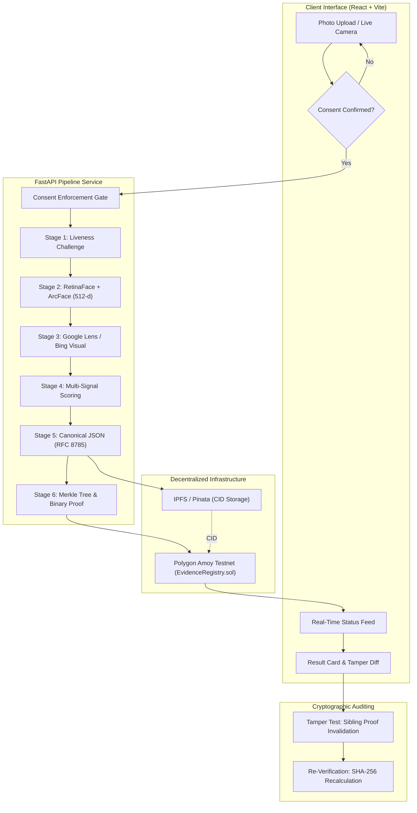
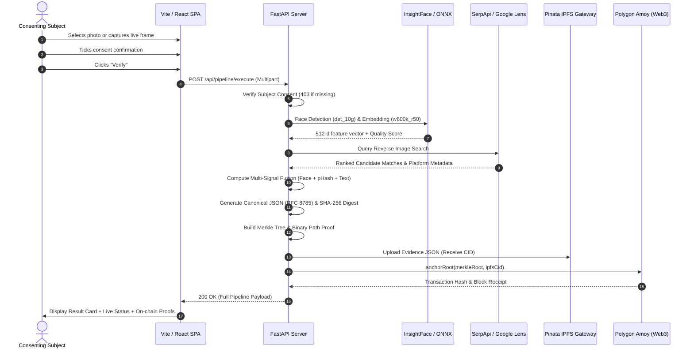
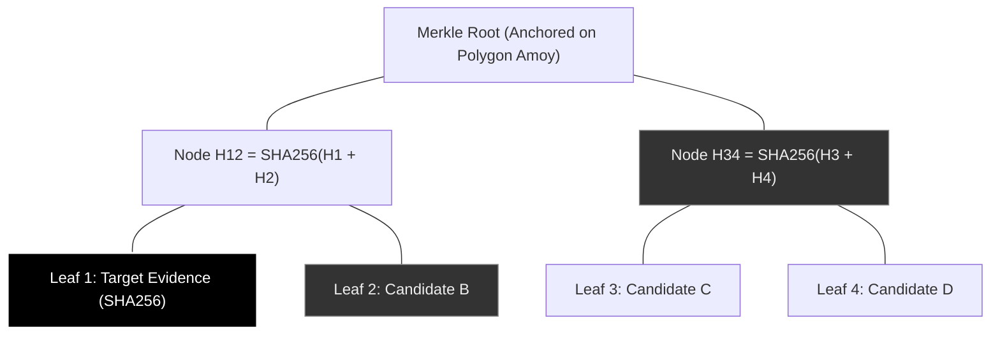

# KAO (顔)

### Consent-Gated Face Discovery & Merkle-Anchored Attestation Pipeline

[](https://python.org)
[](https://fastapi.tiangolo.com)
[](https://react.dev)
[](https://vitejs.dev)
[](https://amoy.polygonscan.com)
[](https://pinata.cloud)
[](tests/)

> **Evidence integrity, not identity ownership.**
> KAO proves that an evidence record captured at timestamp $T$ has not been modified or tampered with since anchoring. It does **not** claim to prove that *"Person X is the legal owner of Account Y"*.

---

## 1. System Architecture



---

## 2. End-to-End Sequence Flow



---

## 3. The 9-Stage Verification & Attestation Pipeline

| Stage | Name | Technology | Security & Privacy Guarantees |
|---|---|---|---|
| **0** | **Consent Gate** | UI State + Backend Guard | Pipeline rejects requests without explicit subject authorization (**HTTP 403**). |
| **1** | **Liveness Check** | Interactive Challenge | Prevents automated scraping of static third-party photographs. |
| **2** | **Face Extraction** | InsightFace RetinaFace + ArcFace | Computes 512-d biometric embedding in volatile RAM. **Never persisted to disk or chain.** |
| **3** | **Web Discovery** | SerpApi (Google Lens) / Bing | Multi-platform discovery (LinkedIn, GitHub, Twitter/X, Medium, News). |
| **4** | **Multi-Signal Scoring** | Cosine Sim + pHash + TF-IDF | Fuses face similarity ($0.50$), perceptual hash ($0.25$), text similarity ($0.15$), and rank ($0.10$). |
| **5** | **Evidence Canonicalization**| RFC 8785 JSON + SHA-256 | Deterministic byte-for-byte serialization producing a immutable leaf hash. |
| **6** | **Merkle Batching** | Binary Merkle Tree | Computes cryptographically verifiable inclusion proofs `[(sibling, direction)]`. |
| **7a**| **Decentralized Storage** | Pinata IPFS | Content-addressed storage returning a tamper-resistant IPFS CID. |
| **7b**| **Blockchain Anchoring** | Polygon Amoy / Web3.py | Smart contract stores `(merkleRoot, ipfsCid, timestamp, submitter)` on-chain. |
| **8** | **Re-Verification & Tampering**| Cryptographic Audit | Reconstructs the Merkle root from leaf to proof; detects alteration of even 1 bit. |

---

## 4. Merkle Tree & Tamper-Detection Architecture



When a user triggers the **Run Tamper Test**:
1. An evidence field (e.g. `confidence_tier`) is modified from `HIGH` to `LOW`.
2. The leaf hash is recomputed: $H_{\text{tampered}} \neq H_{\text{original}}$.
3. Walking the Merkle proof produces $R_{\text{tampered}} \neq R_{\text{anchored}}$.
4. Cryptographic audit fails immediately with `hashes_match: false` and `proof_valid: false`.

---

## 5. Smart Contract: `EvidenceRegistry.sol`

Deployed to the **Polygon Amoy Testnet** (Chain ID `80002`):

```solidity
// SPDX-License-Identifier: MIT
pragma solidity ^0.8.20;

contract EvidenceRegistry {
    struct AnchorRecord {
        uint256 timestamp;
        address submitter;
        string ipfsCid;
        bool exists;
    }

    mapping(bytes32 => AnchorRecord) public anchors;

    event RootAnchored(
        bytes32 indexed merkleRoot,
        address submitter,
        string ipfsCid,
        uint256 timestamp
    );

    function anchorRoot(bytes32 merkleRoot, string calldata ipfsCid) external {
        require(!anchors[merkleRoot].exists, "Root already anchored");
        anchors[merkleRoot] = AnchorRecord({
            timestamp: block.timestamp,
            submitter: msg.sender,
            ipfsCid: ipfsCid,
            exists: true
        });
        emit RootAnchored(merkleRoot, msg.sender, ipfsCid, block.timestamp);
    }

    function getAnchor(bytes32 merkleRoot) external view returns (AnchorRecord memory) {
        return anchors[merkleRoot];
    }
}
```

---

## 6. Getting Started

### Prerequisites
- Python 3.10+
- Node.js 18+ & npm
- macOS / Linux / WSL

### 1. Clone & Setup Repository
```bash
git clone https://github.com/SarthakPatil18/kao.git
cd kao
```

### 2. Configure Environment Variables
Copy `.env.example` to `.env`:
```bash
cp .env.example .env
```
Populate `.env` with your API keys (optional — offline simulation works out-of-the-box):
```env
SERPAPI_KEY=your_serpapi_key_here
PINATA_JWT=your_pinata_jwt_here
RPC_URL=https://rpc-amoy.polygon.technology/
PRIVATE_KEY=your_testnet_private_key_here
CONTRACT_ADDRESS=your_contract_address_here
```

### 3. Install Backend Dependencies
```bash
python3 -m venv .venv
source .venv/bin/activate
pip install -r requirements.txt
```

### 4. Install Frontend Dependencies
```bash
cd frontend
npm install
cd ..
```

---

## 7. Running the Application

### Start the FastAPI Backend (Port 8000)
```bash
python3 -m uvicorn server:app --host 127.0.0.1 --port 8000 --reload
```
* **API URL**: [http://127.0.0.1:8000](http://127.0.0.1:8000)
* **Interactive OpenAPI Swagger Docs**: [http://127.0.0.1:8000/docs](http://127.0.0.1:8000/docs)

### Start the React Frontend (Port 3000)
In a separate terminal:
```bash
cd frontend
npm run dev -- --host 127.0.0.1 --port 3000
```
* **Web UI**: [http://localhost:3000](http://localhost:3000)

---

## 8. Verification & Test Suite

Run the automated test suite covering all cryptographic, biometric, and Merkle operations:

```bash
pytest tests/ -v
```

```text
============================= test session starts ==============================
collected 65 items

tests/test_evidence.py ............                                      [ 18%]
tests/test_liveness.py ..............                                    [ 40%]
tests/test_merkle.py ...............                                     [ 63%]
tests/test_scoring.py ........................                           [100%]

============================== 65 passed in 10.9s ==============================
```

---

## 9. Security & Privacy Philosophy

1. **Zero Biometric Persistence**: Raw face images and 512-d feature vectors exist only in volatile process memory during execution and are discarded immediately.
2. **Deterministic Evidence Proofs**: RFC 8785 canonical JSON ensures that whitespace or key-ordering variations never cause false tamper alarms.
3. **Strict Consent Policy**: The consent checkbox is a hard blocker at both frontend and API levels.
4. **Minimal On-Chain Footprint**: Only cryptographic root hashes and content identifiers touch public ledgers.

---

## 10. License

Licensed under the [MIT License](LICENSE).
